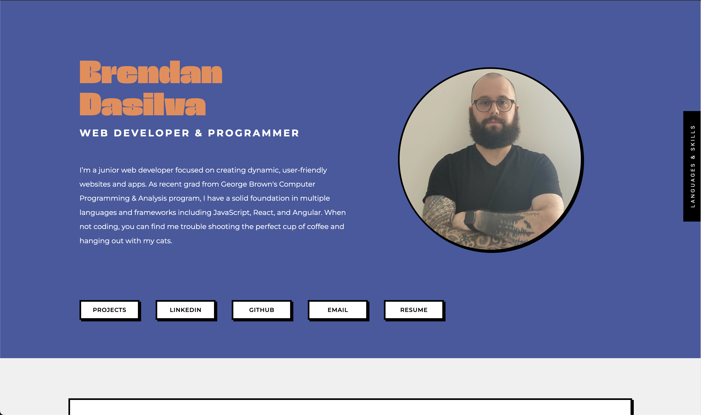
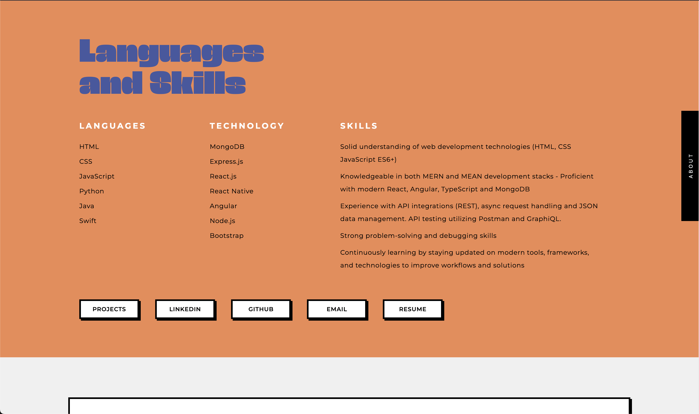
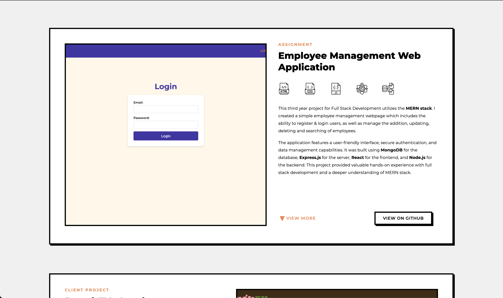
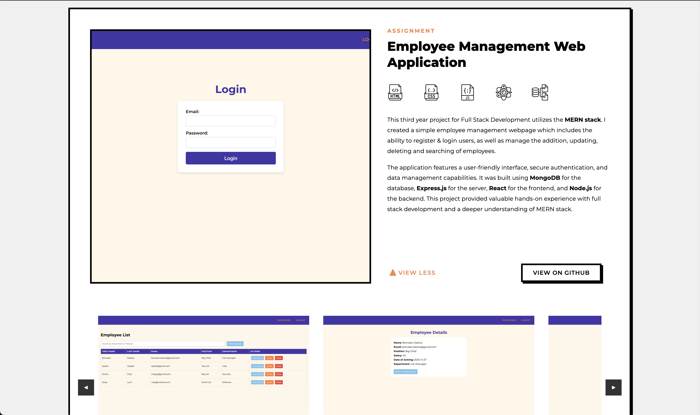
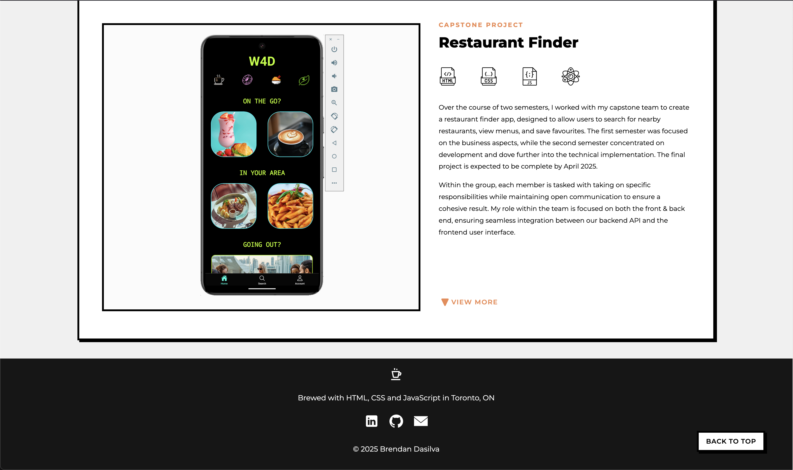

# Portfolio V2

This is the second version of my portfolio – designed and developed in my final year of the Computer Programming & Analysis program at George Brown College.

## 🚀 About This Version

V2 is a complete redesign with a modern layout, better responsiveness, and added interactivity. This version showcases my best work in a more dynamic and structured format, with animated elements, and custom modal project previews.

---

## 🎯 Landing Page

The landing page introduces me with a bold nameplate, short bio, photo, and quick access buttons to projects, LinkedIn, GitHub, and more.

---

## 🧠 Skills Section

The Skills section highlights languages, technologies, and soft skills. It's organized into columns with a strong visual hierarchy and styled headings.

---

## 🔧 Sample Project Card

Each project card includes a short description, icons representing the tech stack, and action buttons like GitHub or “Live Site.”

---

## 📂 Project Section – Expanded View

Projects are displayed in categorized cards (Assignment, Capstone, etc.). Clicking “View More” expands the card to reveal project details, tools used, links, and a screenshot preview carousel.

---

## Footer

The footer includes contact icons and a “Back to Top” button. It also features a personal touch:  
> Brewed with HTML, CSS and JavaScript in Toronto, ON

---
